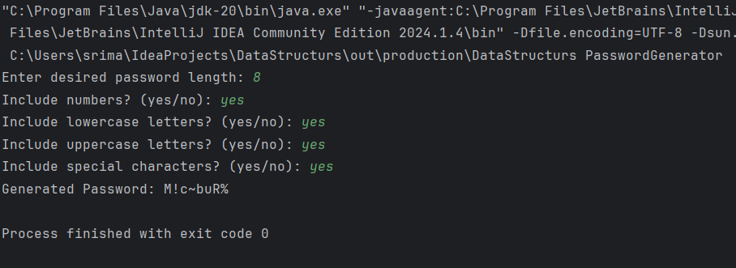

# 🔐 Random Password Generator (Java)

This is a simple **Random Password Generator** built using Java. The program allows users to generate strong, customizable passwords by specifying the desired length and choosing character types to include (numbers, lowercase, uppercase, and special characters).

## 🚀 Features

- User input for password length
- Options to include:
  - Numbers (0-9)
  - Lowercase letters (a-z)
  - Uppercase letters (A-Z)
  - Special characters (!@#$%^&* etc.)
- Randomly generates a secure password
- Prevents generation if no character type is selected

## 🛠 Technologies Used

- Java (JDK 8 or higher)
- Scanner for user input
- Random for character generation

## 🖼️ Screenshot

Below is a sample output of the password generator running in the terminal:

